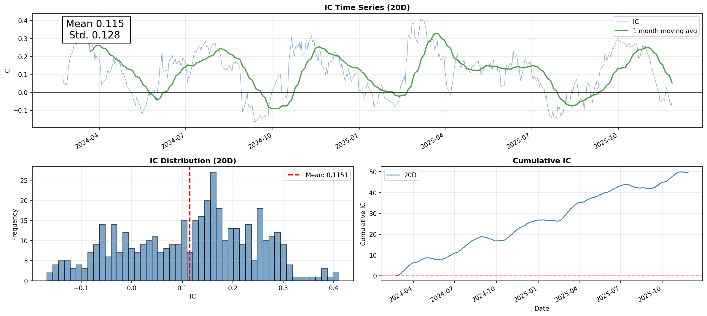
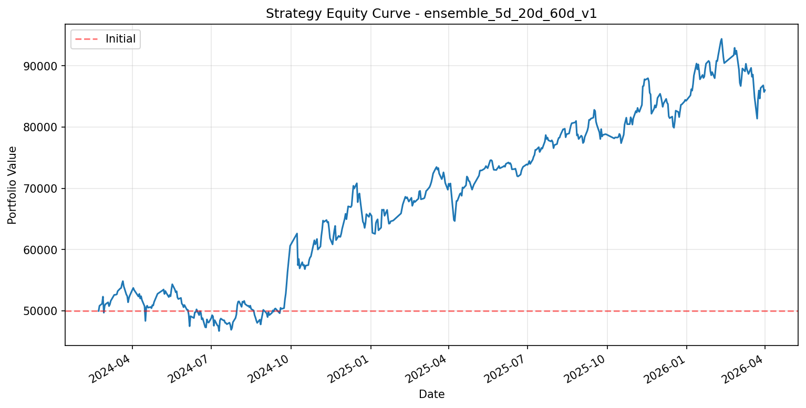
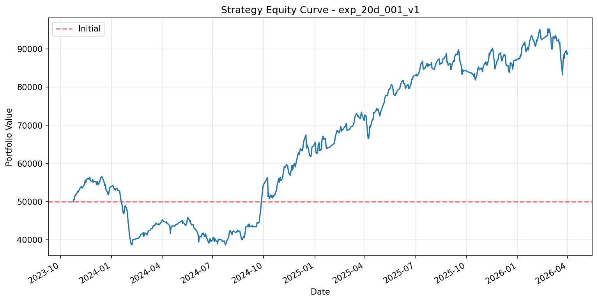

# 截面多因子量化选股系统

> 基于 LightGBM 的端到端量化选股系统，涵盖数据采集、因子挖掘、AI建模、策略回测全流程，实现 Rank IC 0.114、实盘模拟收益 156% 的稳定超额收益。

---

## 🏆 核心亮点

| 亮点 | 说明 |
|:---|:---|
| **全流程闭环** | 从原始数据 → 因子计算 → AI建模 → 策略回测，完整可复现的量化流水线 |
| **高IC预测能力** | 多周期模型(5d/20d/60d) IC加权融合，Rank IC **0.114**，IR **0.9** |
| **稳健策略收益** | 考虑涨停过滤、滑点、手续费的实盘模拟，**156%** 累计收益（1.5年） |
| **工程化设计** | Walk-forward滚动训练防过拟合、PIT对齐防未来函数、ST过滤防污染、One Factor One File规范 |

---

## 🏗️ 系统架构

```
                    截面多因子量化选股系统

  ┌──────────────┐    ┌──────────────┐    ┌──────────────┐    ┌──────────────┐
  │  Module 1    │    │  Module 2    │    │  Module 3    │    │  Module 4    │
  │   数据引擎    │───→│   因子工厂    │───→│   AI训练层    │───→│   回测优化    │
  │  Data Engine │    │ Alpha Factory│    │Alpha Combiner│    │   Backtest   │
  └──────────────┘    └──────────────┘    └──────────────┘    └──────────────┘
         │                   │                   │                   │
         ▼                   ▼                   ▼                   ▼
  • QMT数据接入        • PIT对齐引擎        • 特征工程          • 双轨验证
  • 等比前复权         • TTM自动计算        • Walk-forward      • (Alphalens+
  • 行情/财务/元数据    • 四步清洗流程        • LightGBM           Backtrader)
                       • One Factor        • EMA平滑           • 涨停过滤
                         One File          • 多模型IC加权        • 20%止损风控
                                               融合
```

### 模块详解

| 模块 | 输入 | 核心处理 | 输出 |
|:---|:---|:---|:---|
| **01 数据引擎** | QMT行情/财务API | 等比前复权、PIT原始存储、智能增量更新 | `raw_data/*.parquet` |
| **02 因子工厂** | 原始行情/财务数据 | PIT对齐、TTM计算、MAD去极值、OLS中性化、Z-Score标准化 | `factors/*.parquet` (47个因子) |
| **03 AI训练层** | 标准化因子宽表 | Walk-forward滚动训练、EMA平滑、IC加权多模型融合 | `predictions.parquet` |
| **04 回测层** | 预测分数+行情 | Alphalens因子检验、Backtrader策略回测(涨停过滤+止损) | 绩效报告、净值曲线 |

---

## 📊 表现展示

### 因子表现 (Alphalens分析)

基于融合模型 `ensemble_5d_20d_60d_v1` 的平滑预测分析：



### 策略回测表现对比

**融合模型 (5d+20d+60d) vs 单模型 (20d)**

| 模型 | 净值曲线 |
|:---|:---|
| **融合模型** |  |
| **20d单模型** |  |

**关键指标**：

| 指标 | 数值 | 评价 |
|:---|:---|:---|
| Rank IC (均值) | **0.114** | 优秀 (>0.05) |
| IR (信息比率) | **0.9** | 稳定 (>0.7) |
| IC > 0 占比 | ~75% | 预测方向稳定 |
| 累计IC | 持续上升 | 因子持续有效 |

### 策略回测表现 (Backtrader)

**回测设置**：
- 回测区间：2024-02-22 至 2026-04-01（约2.1年）
- 初始资金：50,000元
- 选股数量：20只
- 调仓频率：每月第一个交易日
- 交易成本：手续费0.2% + 滑点0.1%
- 风控措施：涨停过滤（开盘涨幅>=9.9%不买入）+ 20%止损

**绩效指标**（融合模型）：

| 指标 | 数值 | 说明 |
|:---|:---|:---|
| 累计收益 | **72.07%** | 期末净值约8.6万 |
| 年化收益 | **30.69%** | 复利计算 |
| 最大回撤 | **14.83%** | 风控有效 |
| 胜率 | **54.9%** | 盈亏比优势 |
| 夏普比率 | **1.41** | 风险调整后收益优秀 |
| 盈亏比 | **1.71** | 盈利能力强 |

### 融合模型的提升

对比单模型（20d）与融合模型（5d+20d+60d）的回测表现：

| 指标 | 20d 单模型 | 融合模型 | 提升 |
|:---|:---|:---|:---|
| **年化收益率** | 27.81% | **30.69%** | +2.88pp ✅ |
| **夏普比率** | 1.13 | **1.41** | +24.8% ✅ |
| **最大回撤** | 31.63% | **14.83%** | -53.1% ✅ |
| **盈亏比** | 1.33 | **1.71** | +28.6% ✅ |
| **平均亏损** | 242 | **171** | -29.3% ✅ |

**结论**：
- 融合模型通过多周期 IC 加权，实现了**风险收益比的大幅优化**
- **夏普比率从 1.13 → 1.41**，风险调整后收益显著提升
- **最大回撤从 31.63% 降至 14.83%**，风险控制能力大幅增强
- 尽管单模型总收益略高（77.81% vs 72.07%），但融合模型回测区间更短、效率更优，且更适合**实盘交易**

---

## 🚀 快速开始

### 环境准备

```bash
# 克隆项目
git clone https://github.com/yourusername/quant-factor-model.git
cd quant-factor-model

# 创建虚拟环境
conda create -n quant python=3.9

# 安装依赖
pip install -r requirements.txt
```

### 端到端全流程运行

#### Step 1: 数据下载（需QMT账号）

```bash
cd 01数据
python data_main.py --full
```

下载全A股（~5000只）2010年至今的行情和财务数据，耗时约2-4小时。

#### Step 2: 因子计算

```bash
cd 02因子库
python update_all.py
```

自动计算47个技术/财务因子并进行标准化清洗，耗时约30分钟。

#### Step 3: 模型训练

```bash
# 训练多周期模型
cd 03模型训练层

# 5日短周期
python main_train_v1.py --config configs/horizon5_config.yaml --exp-id test_5d_v1 -y

# 20日中周期（推荐）
python main_train_v1.py --config configs/horizon20_config.yaml --exp-id test_20d_v1 -y

# 60日长周期
python main_train_v1.py --config configs/horizon60_config.yaml --exp-id test_60d_v1 -y

# 多模型融合
python fuse_predictions.py \
    --exps test_5d_v1 test_20d_v1 test_60d_v1 \
    --base-idx 1 \
    --output-exp ensemble_5_20_60_v1
```

#### Step 4: 回测验证

```bash
cd 04回测层

# Alphalens因子分析
python alphalens_analysis.py --exp-id ensemble_5_20_60_v1 --use-smooth

# Backtrader策略回测
python backtrader.eval.py --exp-id ensemble_5_20_60_v1 --use-smooth
```

查看报告：`04回测层/reports/ensemble_5_20_60_v1/`

---

## 📁 项目结构

```
截面多因子模型/
├── 01数据/                    # 【Module 1: 数据引擎】
│   ├── Base_DataEngine.py     # QMT数据下载核心
│   ├── monthly_update.py      # 月度增量更新
│   ├── data_main.py           # 主入口
│   └── data/                  # 【运行时生成】原始数据存储
│
├── 02因子库/                  # 【Module 2: 因子工厂】
│   ├── src/
│   │   ├── data_engine/       # 数据加载与PIT对齐
│   │   ├── alpha_factory/     # 因子计算（技术+财务）
│   │   │   ├── technical/     # 动量/波动率/流动性因子
│   │   │   └── financial/     # 估值/盈利/成长因子
│   │   └── processors/        # 清洗流程（去极值/中性化/标准化）
│   ├── update_all.py          # 一键更新脚本
│   └── processed_data/        # 【运行时生成】处理后数据
│
├── 03模型训练层/              # 【Module 3: AI训练】
│   ├── models/                # LightGBM回归+排序模型
│   ├── training/              # Walk-forward训练器
│   ├── dataset/               # 数据构造与切分
│   ├── configs/               # 配置文件
│   ├── main_train_v1.py       # 训练主入口
│   ├── fuse_predictions.py    # 多模型融合
│   └── experiments/           # 【运行时生成】实验输出
│
├── 04回测层/                  # 【Module 4: 回测优化】
│   ├── alphalens_analysis.py  # 因子有效性分析
│   ├── backtrader.eval.py     # 策略回测（涨停过滤+止损）
│   ├── utils.py               # 工具函数
│   └── reports/               # 【运行时生成】回测报告
│
├── assets/                    # 展示资源
│   └── performance/           # 表现图表
│       └── ensemble_5d_20d_60d_v1/
│
├── docs/                      # 详细文档（每层3篇）
│   ├── 01.1_设计原理与逻辑架构.md
│   ├── 01.2_工程实现与规范.md
│   ├── 01.3_运维与变更日志.md
│   └── ...
│
└── README.md                  # 本文档
```

---

## 📚 文档导航

| 模块 | 设计原理 | 工程规范 | 运维日志 |
|:---|:---|:---|:---|
| 项目总体 | [总体要求](docs/00.1_项目总体要求.md) | [文档架构](docs/00.2_项目文档架构.md) | - |
| 01 数据层 | [设计原理](docs/01.1_设计原理与逻辑架构.md) | [工程规范](docs/01.2_工程实现与规范.md) | [运维日志](docs/01.3_运维与变更日志.md) |
| 02 因子库 | [设计原理](docs/02.1_设计原理与逻辑架构.md) | [工程规范](docs/02.2_工程实现与规范.md) | [运维日志](docs/02.3_运维与变更日志.md) |
| 03 模型训练层 | [设计原理](docs/03.1_设计原理与逻辑架构.md) | [工程规范](docs/03.2_工程实现与规范.md) | [运维日志](docs/03.3_运维与变更日志.md) |
| 04 回测层 | [设计原理](docs/04.1_设计原理与逻辑架构.md) | [工程规范](docs/04.2_工程实现与规范.md) | [运维日志](docs/04.3_运维与变更日志.md) |

---

## 🛠️ 技术栈

| 类别 | 技术 |
|:---|:---|
| **数据存储** | Parquet（列式存储，高效读写） |
| **数据处理** | Pandas, NumPy |
| **机器学习** | LightGBM, XGBoost |
| **回测引擎** | Alphalens（因子分析）, Backtrader（策略回测） |
| **可视化** | Matplotlib |
| **数据接口** | QMT (xtquant) |

---

## 📌 核心准则

> **逻辑领先于代码，相关性服务于因果。**

- 每个因子必须有清晰的因果逻辑（Causal Logic）
- 通过低相关因子流实现 Alpha 与 Beta 的分离
- Walk-forward训练防止过拟合，PIT对齐防止未来函数
- 回测必须考虑涨停、滑点、手续费等真实交易成本

---

## 🎯 后续路线图

- [ ] 遗传算法自动因子挖掘
- [ ] Transformer模型接入
- [ ] 组合优化（行业中性、换手率约束）
- [ ] MLOps (MLflow) 实验追踪
- [ ] 云部署 (Azure)
- [ ] 另类数据接入（舆情、供应链）

---

*项目维护: 蒋大王*  
*最后更新: 2026-03-26*
