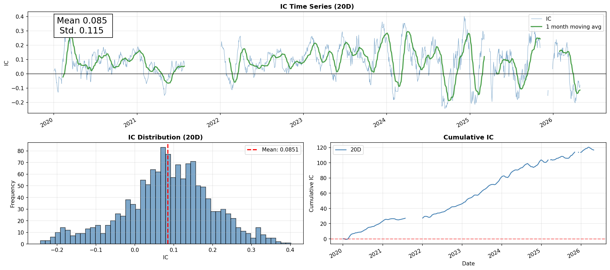
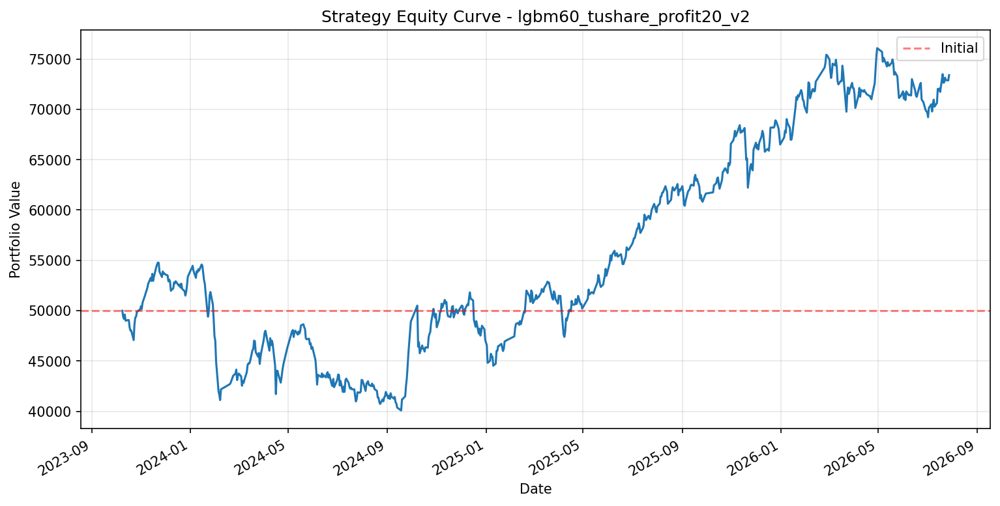
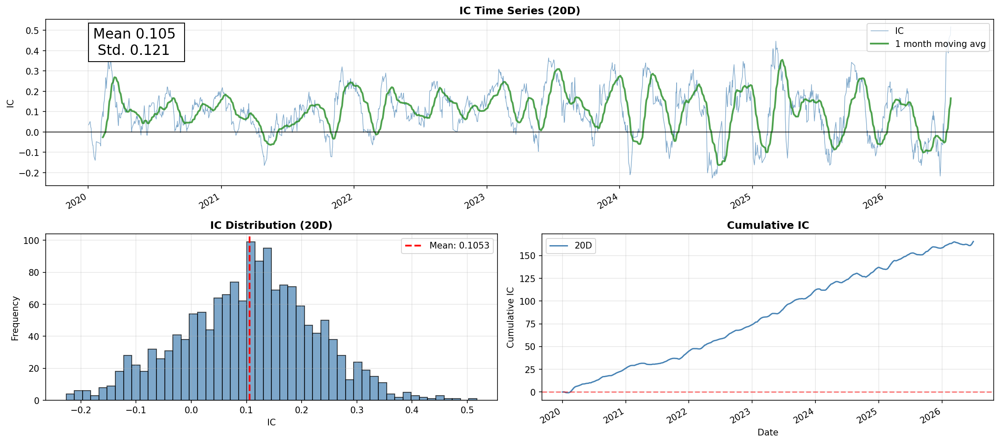
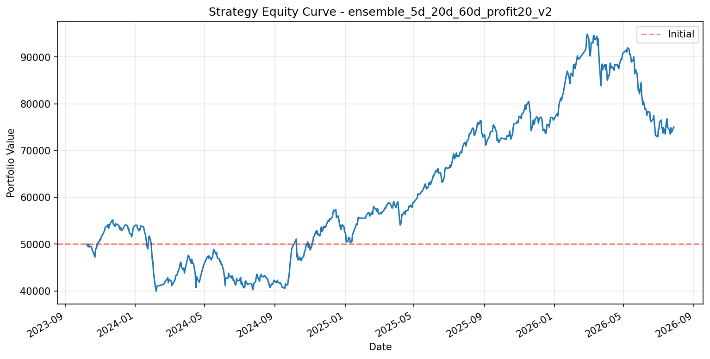
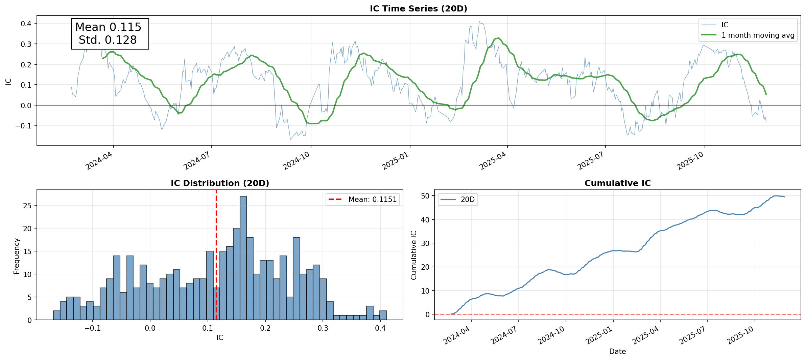
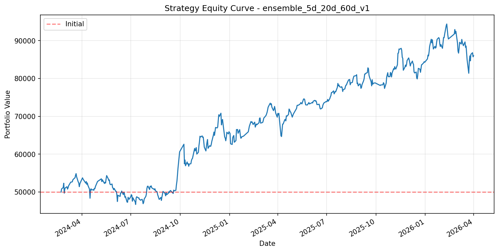

# 截面多因子量化选股系统

> 基于 Tushare、PIT 因子工程和 LightGBM Quarterly PIT V2 的 A 股截面选股系统，覆盖数据采集、因子构建、模型训练、策略回测和正式 Alpha 发布。

## 当前状态

截至 2026-08-01：

- 01 数据层、02 因子层和 03 模型训练层已由 QMT 迁移至 Tushare，旧 QMT 数据仅保留作历史对照。
- 数据层和因子层已完成迁移验收，45 个因子已基于 Tushare 数据重建。
- 模型训练层已统一到 Quarterly PIT V2，V1 Walk-forward 入口已退役。
- 5 日、20 日和 60 日 Tushare 模型均已完成全量 Freeze 训练、Alphalens 与 Backtrader 回测。
- 5d/20d/60d 滞后 IC 融合实验已完成回测，并与三个单模型一同发布为正式 Alpha。
- 04 回测层的 Alphalens 和 Backtrader 已兼容 V2 单一 PIT 预测链，Backtrader 使用 Tushare ST 状态。
- 05 输出层已实现版本化正式 Alpha 发布、manifest 审计和 current 默认指针。
- README 和分层设计文档已按当前 Tushare/V2/Alpha 发布主链路同步。

## 系统架构

```text
Tushare
   │
   ▼
01 数据层
行情 / 复权因子 / 财务四表 / ST / 停牌 / 元数据
   │
   ▼
02 因子层
行情宽表 + 财务 PIT/TTM + 45 个清洗后因子
   │
   ▼
03 模型训练层
Quarterly PIT V2 + LightGBM + Freeze 增量 + 多周期融合
   │
   ▼
04 回测层
Alphalens + Backtrader + 验收报告
   │
   ▼
05 输出层
正式 Alpha release + manifest + current 指针
```

| 模块 | 输入 | 核心处理 | 主要输出 |
|:---|:---|:---|:---|
| 01 数据层 | Tushare Pro API | 断点续跑、等比前复权、财务原始版本存储、状态数据构建 | `01数据/data/tushare_data/` |
| 02 因子层 | Tushare 行情与财务原始层 | PIT 版本选择、TTM、去极值、中性化、标准化 | `02因子库/processed_data/` |
| 03 模型训练层 | 行情宽表和 45 个因子 | Open-to-open 标签、季度固定模型、Freeze 增量、参数调优 | `03模型训练层/experiments/` |
| 04 回测层 | 模型预测和行情 | IC 分析、交易成本、涨停/ST过滤、止损与调仓 | `04回测层/reports/` |
| 05 输出层 | 已验收训练实验 | 字段标准化、完整性检查、版本化发布、来源审计 | `05输出层/exports/` |

## 核心设计

### Tushare 原始数据层

- 行情按交易日抓取并按股票落盘，支持分片断点续跑。
- 使用 `raw_price × adj_factor / latest_adj_factor` 构建等比前复权价格。
- `income`、`balancesheet`、`cashflow`、`fina_indicator` 按报告期保存完整原始版本。
- ST、停牌、股票基础信息、交易日历和行业映射独立存储。

### PIT 因子工程

- 财务版本选择发生在因子层，按公告日保证当时可知。
- 流量类字段使用严格 TTM，时点类字段使用最新已披露期末值。
- 因子按宽表独立存储，遵循 One Factor, One File。
- 当前因子库包含 21 个技术因子和 24 个财务因子。

### Quarterly PIT V2

- 每个自然季度训练一个固定模型，该季度内所有交易日使用同一模型预测。
- 标签采用真实可执行的 open-to-open 收益：

```text
label(T) = open[T + horizon + 1] / open[T + 1] - 1
```

- 训练与验证之间保留 `horizon + 1` 个交易日的隔离区间。
- `--freeze` 模式复用已生成的季度模型和历史信号，只追加新日期。
- 5 日、20 日和 60 日模型可按历史 IC 进行滞后加权融合。

## 项目结构

```text
截面多因子模型/
├── 01数据/
│   ├── Base_TushareEngine.py
│   ├── tushare_data_main.py
│   ├── tushare_weekly_update.py
│   └── README.md
├── 02因子库/
│   ├── src/data_engine/
│   ├── src/alpha_factory/
│   ├── src/processors/
│   ├── update_all.py
│   ├── validate_tushare_factor_migration.py
│   └── README.md
├── 03模型训练层/
│   ├── configs/
│   │   └── production/
│   ├── dataset/
│   ├── models/
│   ├── training/
│   ├── tuning/
│   ├── main_train_v2.py
│   ├── fuse_predictions.py
│   └── README.md
├── 04回测层/
│   ├── alphalens_analysis.py
│   ├── backtrader.eval.py
│   ├── utils.py
│   └── README.md
├── 05输出层/
│   ├── publish_alpha.py
│   ├── exports/
│   └── README.md
├── assets/
├── docs/
└── README.md
```

运行时数据、实验结果、回测报告和本地密钥均由 `.gitignore` 排除。

## 环境准备

推荐使用 Python 3.9+ 的独立环境。当前仓库尚未维护统一的 `requirements.txt`，主要依赖如下：

```powershell
pip install tushare pandas numpy pyarrow scipy statsmodels scikit-learn
pip install lightgbm pyyaml optuna matplotlib backtrader alphalens-reloaded
```

在 `01数据/tushare_token.txt` 中保存一行 Tushare Pro token，或设置环境变量 `TUSHARE_TOKEN`。Token 文件不会进入 Git。

## 端到端运行

以下命令均在项目根目录执行。

### 1. 下载或更新数据

首次全量下载：

```powershell
python 01数据/tushare_data_main.py --full
```

日常每周更新：

```powershell
python 01数据/tushare_data_main.py --weekly
```

数据层只负责更新 `01数据/data/tushare_data/`，不会自动重建因子。

### 2. 重建因子层

```powershell
python 02因子库/src/data_engine/main_prepare_market_data.py --overwrite
python 02因子库/src/data_engine/main_prepare_financial_data.py --overwrite
python 02因子库/src/alpha_factory/technical/main_compute_technical.py
python 02因子库/src/alpha_factory/financial/main_compute_financial.py
python 02因子库/validate_tushare_factor_migration.py --full-values --pit-samples 30
```

也可以使用统一入口计算基础宽表和全部因子：

```powershell
python 02因子库/update_all.py
```

### 3. 训练正式模型

正式配置统一放在 `03模型训练层/configs/production/`，调参原始输出保留在 `03模型训练层/tuning/tuning_results/`。

20 日模型：

```powershell
python 03模型训练层/main_train_v2.py `
  --config horizon20_profit20_tuned_config.yaml `
  --exp-id lgbm20_tushare_profit20 `
  --start-date 2020-01-01 `
  --freeze -y
```

5 日和 60 日模型分别使用：

```text
03模型训练层/configs/production/horizon5_profit20_tuned_config.yaml
03模型训练层/configs/production/horizon60_profit20_tuned_config.yaml
```

`main_train_v2.py` 会将 V2 实验写入 `03模型训练层/experiments/{exp_id}_v2/`。

### 4. 融合预测

```powershell
python 03模型训练层/fuse_predictions.py `
  --exps <5d_exp_id> <20d_exp_id> <60d_exp_id> `
  --base-idx 1 `
  --output-exp <ensemble_exp_id>
```

融合结果会生成标准 `config.yaml`，通过回测验收后可直接使用 05 输出层发布；其 horizon 取 `base-idx` 对应模型。

融合以 20 日模型为基准标签，权重只使用当时已经可知的历史 IC。

### 5. 分析与回测

```powershell
python 04回测层/alphalens_analysis.py --exp-id <exp_id> --use-smooth
python 04回测层/backtrader.eval.py --exp-id <exp_id> --use-smooth
```

### 6. 发布正式 Alpha

仅发布已经完成训练和回测验收的实验：

```powershell
python 05输出层/publish_alpha.py `
  --exp-id lgbm20_tushare_profit20_v2 `
  --release-id alpha_20d_tushare_profit20
```

正式输出保存在 `05输出层/exports/releases/{release_id}/`，`current.json` 自动指向最近一次成功发布的正式版本。

## 配置管理

| 目录 | 用途 |
|:---|:---|
| `configs/*.yaml` | 各预测周期的基准配置 |
| `configs/production/*.yaml` | 已晋升的正式训练配置，使用项目相对路径 |
| `tuning/tuning_results/*/final_recommended_config.yaml` | 调参程序原始输出和审计记录 |
| `experiments/{exp_id}_v2/config.yaml` | 单次实验实际使用的配置快照 |

调参结果晋升到 `production/` 后，正式运行应使用 production 配置；不要直接修改调参结果目录中的原始文件。

## 正式回测结果与历史基线

当前 Tushare 正式实验统一使用 2023-10-09 至 2026-07-28 的 Backtrader 回测区间：

| 指标 | 60d 单模型 | 5d/20d/60d 融合 |
|:---|---:|---:|
| Rank IC | 0.0851 | 0.1053 |
| IR | 0.7409 | 0.8702 |
| 累计收益 | 46.79% | 50.08% |
| 年化收益 | 15.26% | 16.21% |
| 最大回撤 | 26.82% | 27.66% |
| 夏普比率 | 0.51 | 0.52 |

不同 horizon 的 IC 对应各自标签口径，不宜只凭 IC 横向判断交易表现。融合全期收益略高，但 2026 年近期回撤和利润回吐大于 60d，正式使用时仍需结合风险偏好选择默认 release。

### 当前 Tushare 正式结果









完整展示产物保存在 `assets/performance/lgbm60_tushare_profit20_v2/` 和 `assets/performance/ensemble_5d_20d_60d_profit20_v2/`。

### 迁移前历史基线

仓库中的展示图表来自数据源迁移前的 5d/20d/60d 融合实验，用于保留历史比较基线，不代表当前 Tushare 重训结果。

| 指标 | 历史融合模型 |
|:---|---:|
| Rank IC 均值 | 0.114 |
| IR | 0.90 |
| 累计收益 | 72.07% |
| 年化收益 | 30.69% |
| 最大回撤 | 14.83% |
| 夏普比率 | 1.41 |





迁移前图表仅用于历史对照，不代表当前 Tushare 正式结果。

## 文档导航

| 模块 | 模块 README | 设计原理 | 工程规范 | 运维日志 |
|:---|:---|:---|:---|:---|
| 01 数据层 | [README](01数据/README.md) | [设计](docs/01.1_设计原理与逻辑架构.md) | [工程](docs/01.2_工程实现与规范.md) | [运维](docs/01.3_运维与变更日志.md) |
| 02 因子层 | [README](02因子库/README.md) | [设计](docs/02.1_设计原理与逻辑架构.md) | [工程](docs/02.2_工程实现与规范.md) | [运维](docs/02.3_运维与变更日志.md) |
| 03 模型训练层 | [README](03模型训练层/README.md) | [设计](docs/03.1_设计原理与逻辑架构.md) | [工程](docs/03.2_工程实现与规范.md) | [运维](docs/03.3_运维与变更日志.md) |
| 04 回测层 | [README](04回测层/README.md) | [设计](docs/04.1_设计原理与逻辑架构.md) | [工程](docs/04.2_工程实现与规范.md) | [运维](docs/04.3_运维与变更日志.md) |
| 05 输出层 | [README](05输出层/README.md) | [设计](docs/05.1_设计原理与逻辑架构.md) | [工程](docs/05.2_工程实现与规范.md) | [运维](docs/05.3_运维与变更日志.md) |

## 路线图

- [x] 数据源迁移至 Tushare
- [x] 行情、财务、ST、停牌和元数据全链路重建
- [x] 45 个 Tushare 因子重建与迁移验收
- [x] Quarterly PIT V2 与 Freeze 增量模式
- [x] LightGBM V2 参数调优和 production 配置管理
- [x] 正式 Alpha 版本化发布与下游文件契约
- [x] 完成 Tushare 版 5d/20d/60d 全量训练与回测
- [x] 更新三周期融合模型、回测基线和正式 release
- [ ] 将组合优化正式接入主链路
- [ ] 增加统一依赖锁定和自动化测试
- [ ] MLOps 实验与模型版本管理

---

*维护者：蒋大王*
*最后更新：2026-08-01*
